<div align="center"><h1>GMSK调制解调 Matlab仿真</h1></div>

### GMSK介绍

l979 年由日本国际电报电话公司提出的GMSK调制方式．有较好的功率频 谱特性，较低的误码性能，特别是带外辐射小，很适用于工作在VHF和UHF频 段的移动通信系统，越来越引起人们的关注。GMSK 调制方式的理论研究已 1  较成熟．实际应用却还不多，主要是由于高斯滤波器的设计和制作在工程上还有 一定的困难。  高斯最小频移键控(GMSK)由于带外辐射低因而具有很好的频谱利用率，其 恒包络的特性使得其能够使用功率效率高的 C 类放大器。这些优良的特性使其 作为一种高效的数字调制方案被广泛的运用于多种通信系统和标准之中。 

其中包括:

- 依据欧洲通信标准化委员会(ETSI )制定的GSM技术规范研制而成的全 球通(GSM)数字蜂窝移动系统;  
- 由欧洲邮政与电信协会(CEPT)制定的作为欧洲通信标准ETS1300一175 的无绳通信标准(DECT);  
- 英国和香港，基于无绳电话(CordlessPhones)和电信点(Telepoint )系统的 通信标准，CT-2和CT-3系统;  
- 基于爱立信公司提出的Mobitex协议的，Mobitex系统(欧洲)和RAM移 动数据系统(美国);  
- 建立在北美高级移动电话系统(AMPS)上实现无线数据业务的蜂窝数字 分组数据(CDPD)系统;  
- 第三代个人通信系统(PCs)中，美国的基于GSM标准的PCS1900;以及 欧洲的由ETIS开发和制定的个人通信网(PCN )标准DCSI 800;  
- 作为欧洲无线局域网(WLAN)标准的 HiperLAN /1 以及如今讨论的很多 的作为无线个人网络(WPAN)标准的蓝牙(Bluetooth )系统;  
- 专用系统中有根据国际民肮组织(ICAO)制定的卫星通信、导航、搜索/ 空中交通管理} CNS /ATM )系统等;  
- 通用分组无线服务(GPRS)以及改进数据率GSM服务(EDGE)作为由第二 代通信标准向 第三代通信标准过渡方案也是以GMSK作为其调制方案;  

1999年，国际电联ITU着手建立的第三代无线通信标准IMT2000体系。 根据不同的应用和技术将其分成5大类:

（1）IMT —DS：基于ETSI的 W - CDMA技术，采用直序列扩频技术的CDMA方案;

（2）IMT—MC： 基于北美的CDMA One，采用多载波CDMA技术；

（3）IMT –TC：基于 ETSI 的TD - CDMA技术，采用时分双工(TDD )和TDMA / CDMA的多 址方式；

（4）IMT—SC ：基于UWC—136 /EDGE网络;

（5）IMT—FT： 基于采用FDM.4的DECT技术。

其中后三类无线接口的调制方式都采用 GMSK技术或者与之兼容。  

GMSK 有着广泛的应用。因此，从上世纪80年代提出该技术以来，广大科研人员进行了大量的针对其调制解调方案的研究。

### GMSK的原理分析

#### GMSK的基本原理 

高斯滤波最小频移键控（Gaussian Filtered Minimum Shift Keying, GMSK）是一种在MSK基础上改进而来的数字调制方式。其基本原理是将基带信号先通过高斯低通滤波器进行脉冲成形，再进行MSK调制，如图1所示。


<div align="center">图1 GMSK信号调制基本原理图</div>

该高斯滤波器能够将基带信号变换为高斯脉冲信号，其包络无陡峭边沿和拐点，从而改善MSK信号的频谱特性。高斯滤波器平滑了MSK信号的相位曲线，稳定了信号的频率变化，显著降低了发射频谱的旁瓣电平。

为实现GMSK调制，需设计一个性能良好的高斯低通滤波器，其应具备以下特性：

- 良好的窄带特性和尖锐的截止特性，以滤除基带信号中的高频成分；
- 脉冲响应过冲量小，防止已调波瞬时频偏过大；
- 输出脉冲响应曲线面积对应的相位为 $\frac{\pi}{2}$，使调制指数为 $0.5$。

高斯低通滤波器的脉冲响应 $h(t)$ 可表示为：
$$
h(t) = \sqrt{\frac{2\pi}{\ln 2}} B_{\text{3dB}} \exp\left\{ -\frac{2}{\ln 2} (\pi B_{\text{3dB}} t)^2 \right\}
$$
其中，$B_{\text{3dB}}$ 为高斯滤波器的3dB带宽。


<div align="center">图2 高斯滤波器的矩形脉冲响应</div>

其矩形脉冲响应 $g(t)$ 为：
$$
g(t) = h(t) * \text{rect}\left(\frac{t}{T}\right)
$$
其中，$\text{rect}(x)$ 为矩形函数，定义为：
$$
\text{rect}(x) = 
\begin{cases}
1, & |x| < \frac{1}{2} \\
0, & \text{otherwise}
\end{cases}
$$
经推导，$g(t)$ 可表示为：
$$
g(t) = \frac{1}{2} \left[ \text{erf}\left( -\sqrt{\frac{2}{\ln 2}} \pi B_{\text{3dB}} \left(t - \frac{T}{2}\right) \right) + \text{erf}\left( \sqrt{\frac{2}{\ln 2}} \pi B_{\text{3dB}} \left(t + \frac{T}{2}\right) \right) \right]
$$
其中，$\text{erf}(x)$ 为误差函数：
$$
\text{erf}(x) = \frac{2}{\sqrt{\pi}} \int_0^x e^{-t^2} dt
$$
已调信号的相位表达式为：
$$
\theta(t) = \frac{\pi}{2T} \int_{-\infty}^{t} \left[ \sum_n a_n g\left(\tau - nT - \frac{T}{2}\right) \right] d\tau
$$
其中，$a_n \in \{\pm 1\}$ 为NRZ码元，调制指数 $h = 0.5$，保证一个码元时间内最大相位变化为 $\pi$。

最终，GMSK信号表达式为：
$$
s(t) = \cos\left\{ \omega_c t + \frac{\pi}{2T} \int_{-\infty}^{t} \left[ \sum_n a_n g\left(\tau - nT - \frac{T}{2}\right) \right] d\tau \right\}
$$
由于高斯滤波器引入了码间干扰（即部分响应波形），使得相邻码元之间存在相互影响。该影响程度与高斯滤波器的3dB带宽 $B$ 和码元宽度 $T$ 的乘积 $BT$ 有关。$BT$ 值越小，频谱越紧凑，带外辐射越小，但码间干扰越大。

高斯滤波器的输出脉冲经MSK调制得到GMSK信号，其相位路径由脉冲的形 状决定。由于高斯滤波后的脉冲无陡峭沿，也无拐点，因此，相位路径得到进一 步平滑。


<div align="center">图3 GMSK相位路径图****</div>

#### GMSK信号的调制与解调

##### GMSK信号的调制原理

$\textbf{直接数字调频方案}$：该方案利用脉冲形成后的基带信号直接对压控振荡器VCO进行调频。该方案十分简单，并且在多种模拟和数字系统中采用。例如蜂窝数字分组数据系统(CDPD)和全球通(GSM)。可是该方案不易于集成。而且为了保持中心频率在动态范围内，就必须要求VCO有着较高的线性度和灵敏度。类似的方案还有环路型调制器(见图4)。2 BPSK保证每个码元得相位变化为2，利用锁相环对相位进行平滑。可是如何设计PLL的传输函数，从而满足功率谱特性的需要是一件很困难的事情。


<div align="center">图4 锁相环型GMSK调制器 </div>

$\textbf{正交平衡式调制器}:$我们可以将GMSK信号写作:
$$
\begin{aligned}
s(t) &= \cos(2\pi f_c t + \theta(t)) \\
&= \cos\theta(t)\cos(2\pi f_c t) - \sin\theta(t)\sin(2\pi f_c t)
\end{aligned}
$$
其中, $\theta(t) = \frac{\pi}{2T}\int_{-\infty}^{t}\left[\sum a_n g\left(\tau - nT - \frac{T}{2}\right)\right]d\tau$

因此,同MSK信号类似,GMSK信号也可以采用正交平衡式调制器。其原理框图如图5


<div align="center">图5 正交平衡调制器</div>

该方案有着实现简单,容易实现数字化,以达到最终的大规模集成。但是其缺点是,同相和正交两路输出信号必须进行平衡,否则会出现附加调幅,导致频带的扩展。如果采用利用RAM储存波形的方案,调制时直接查表取值则不用担心平衡问题。可是,当载波频率很高时(例如GSM中的载波频率为900MHz),D/A转换器,以及DSP处理器的速度则成为制约该方案的主要因素。这时候,就需要通过调整同相、正交电路来达到平衡的目的。

##### GMSK的解调原理

$\textbf{GMSK信号的相干解调}:$相干解调技术在基于GMSK调制体制的系统中应用十分广泛。例如,GSM系统中在其基站部分和移动端部分都使用相干解调技术。如果使用相干解调技术,接收机需要知道参考相位,或者进行精确的载波恢复。这也要求接收机拥有本振、锁相环路、以及载波恢复电路等部分,这些都使得接收机的复杂程度和成本增加。


<div align="center">图6 相干解调器</div>

GMSK信号可以类似的采用MSK正交平衡调制方案。因此我们可以并行的实现对它的解调。而且,还可以通过分别对同相部分和正交部分进行相干解调来达到性能的优化。

调制器和解调器的两个相互正交的通道必须进行时钟同步、幅值平衡、以及相位正交,否则系统的性能就会降低。可是随着数据传输速率的提高,其实现的难度也增加了。MSK的串行实现方案避免了并行方案中平衡以及时域同步的问题。但是,它对带通滤波器以及匹配滤波器的精度要求很高。我们可以将GMSK视为QPSK的一种特殊的形式。也就是将码元序列的奇、偶位码元分别调制在同相载波和正交载波上。分别对于这两个正交的载波部分来说,其信息的传输速率为1/2T(bps)。而总的传输速率为1/T(bps)。接收端奇偶码元的判决时间为2T。文献[10]指出在高斯加性白噪声的情况下和基于正交GFSK使用匹配滤波器相干解调方案比较,基于GMSK的并行相干解调方案可以有大约3dB(Eb/No)增益。

系统为补偿由于多径传播产生的时延扩展以及预调制滤波器和检测前滤波器引入的码间干扰,往往在相干解调方案中采用线性均衡技术。可是,由于对接收信号相位的跟踪不良而造成的误码仍然无法消除。因此,在衰落环境下的相干解调技术的性能并不十分理想。

$\textbf{GMSK信号的非相干解调}:$对于GMSK信号可以采用多种非相干技术进行解调。非相干解调技术不需要知道参考相位,因此也就不需要锁相环路、本地晶振以及载波恢复电路了。相对与相干解调技术,非相干解调技术的成本更低,更易于实现。非相干解调技术的种类很多。主要分为限幅鉴频器和差分解调两个大类,以及基于这两大类技术的多种衍生方案。本节分别给出了两种方案的原理图,并对目前关于该方向的研究状况和主要成果进行综述。

- 限幅鉴频器解调:

限幅鉴频器,顾名思义由两个部分组成:限幅器,用来恢复受到噪声和干扰影响的接收信号的恒包络的特性;鉴频器,用来将相位调制转化为幅度调制,以供随后的包络检测。鉴频器之后通常跟随一个低通滤波器,例如一个积分滤波器。信号通过低通滤波器之后进入判决器判决,如图7


<div align="center">图7 限幅解调器</div>

- 非相干差分解调:

非相干差分解调,利用接收信号以及其时延信号进行解调。原理图如7所示:其中C代表一个复常数(当延时为T时,C=-j)。


<div align="center">图8 非相干差分解调器</div>

相干与非相干解调方案各有利弊。相干解调在AWGN环境下,其BER指标更好。但是,在衰落环境下,由于受到载波恢复电路中的锁相环性能的限制,使相干解调的性能下降,误码率增加。而且随机的调频噪声,将部分地影响相邻符号时间内的载波相位的相关性。而对于差分解调来说,则不存在这些因素。因此我们说,在快衰落环境下,非相干解调的性能更优。 

关于相干解调技术的研究己经非常成熟了。相对来说,非相干技术—差分解调的研究较少。而且如前所述差分解调在衰落信道中有着较好的性质。且常规的差分解调相对于相干解调在AWGN环境下有着大约8dB的差距(BER),这同时也意味着还有很大的性能提高的空间。

### Matlab仿真实现原理

```mermaid
graph LR
    %% 输入部分
    A[原始比特序列生成] --> B[比特到符号映射]
    
    %% 发送端 - 调制部分
    B --> C[高斯脉冲成形滤波器]
    C --> D[相位积分器]
    D --> E[I/Q信号生成]
    E --> F[载波调制]
    F --> G[GMSK发送信号]
    
    %% 信道部分
    G --> H[AWGN信道]
    H --> I[加噪GMSK信号]
    
    %% 接收端 - 解调部分
    I --> J[I/Q信号分离]
    J --> K[相关检测器]
    K --> L[路径度量计算]
    
    %% 维特比解码部分
    L --> M[状态转移表]
    M --> N[维特比算法处理]
    N --> O[路径选择与更新]
    O --> P[回溯解码]
    P --> Q[解码比特序列]
    
    %% 性能分析部分
    Q --> R[误码率计算]
    R --> S[性能分析显示]
    
    %% 可视化部分
    G --> T[调制波形显示]
    I --> U[接收信号显示]
    Q --> V[解码结果对比]
    R --> W[系统性能统计]
    
    %% 样式定义
    classDef transmitter fill:#e1f5fe,stroke:#01579b,stroke-width:2px
    classDef channel fill:#fff3e0,stroke:#ef6c00,stroke-width:2px
    classDef receiver fill:#e8f5e8,stroke:#2e7d32,stroke-width:2px
    classDef visualization fill:#f3e5f5,stroke:#4a148c,stroke-width:2px
    
    class A,B,C,D,E,F transmitter
    class H channel
    class J,K,L,M,N,O,P,Q,R receiver
    class T,U,V,W visualization
```



#### 发送端模块（调制部分）

##### 1.原始比特序列生成

```matlab
% 代码实现
original_bits = [1, -1, -1, -1, 1, 1, 1, -1, 1, -1, -1, 1, 1, -1, 1, -1, 1, 1, -1, -1];
```

##### 2.高斯脉冲成形滤波器

```matlab
% 高斯滤波器函数
gt = @(t) (erfc(2*pi*0.3*(t - 2) / sqrt(2*log(2))) - ...
           erfc(2*pi*0.3*(t + 1) / sqrt(2*log(2)))) / 2;
```

##### 3.相位积分

```matlab
% 相位计算核心代码
rtn_1 = arrayfun(@(x) integral(gt, -0.1, x) / (2*Tb), tn_1);
rtn_2 = arrayfun(@(x) integral(gt, -0.1, x) / (2*Tb), tn_2);
rtn   = arrayfun(@(x) integral(gt, -0.1, x) / (2*Tb), tn);

phase = rtn + rtn_1 + rtn_2 + TransferPath(1);
```

##### 4.I/Q信号生成

```matlab
% I/Q信号生成
Sn = sqrt(2*E/Tb) * cos(phase);  % 同相分量
Cn = sqrt(2*E/Tb) * sin(phase);  % 正交分量
```

##### 5.载波调制

```matlab
% 射频信号生成
gmsk_transmit = cos(2*pi*fc*t + phase);
```

#### 信道模块

##### AWGN信号

```matlab
% 加噪处理
Sn_noisy = Sn + 0.5*randn(1,4);
Cn_noisy = Cn + 0.5*randn(1,4);
```

#### 接收端模块（解调部分）

##### 1.I/Q信号分离

从接收信号中提取同相和正交分量,为后续相关检测做准备

##### 2.相关检测器

```matlab
% 相关运算
result1 = dot(Sn1, Sn) + dot(Cn1, Cn);
result2 = dot(Sn2, Sn) + dot(Cn2, Cn);
计算接收信号与候选信号的相关值
```

##### 3.状态转移表

```matlab
TransferTable = [
    0 +1 +1 pi/2 +1 -1 pi -1 +1 pi/2 +1 +1 
    0 +1 +1 pi/2 +1 -1 pi -1 +1 pi/2 +1 -1  
    ... % 8条完整路径
];
```

##### 4.维特比算法处理

```matlab
% 路径选择逻辑
if result1 >= result2
    temp_path = [temp_path; TransferPath(idx, 4:6) TransferPath(idx,1:3)];
    temp_hamming = [temp_hamming; result1];
else    
    temp_path = [temp_path; TransferPath(idx, 7:9) TransferPath(idx,1:3)];
    temp_hamming = [temp_hamming; result2];
end
```

实现最大似然序列检测,处理GMSK固有的码间干扰

##### 5.回溯解码

从最终路径度量回溯找到最优路径,输出解码后的比特序列

### 仿真效果


<div align="center">图1 GMSK调制过程详细显示</div>


<div align="center">图2 发送端GMSK调制信号波形</div>


<div align="center">图3 GMSK解调结果</div>

### 参考文献

[1]王士林，陆存乐，龚初光．现代数字调制技术[M]．人民邮电出版社，1985．  

[2]张辉，曹丽娜. 现代通信原理与技术.西安：西安电子科技大学出版社，2002.  

[3]曹志刚, 钱亚生．现代通信原理．北京：清华大学出版社，2002．  

[4] Hiroshi Harada, Ramjee Presad, Simulation and Software Radio for Mobile  Communications   

[5]杨小牛. 软件无线电原理与应用[M]. 北京：电子工业出版社，2001  

[6]杨允均，武传华. “用MATLAB实现GMSK信号产生与解调”，工程应用， 2005  

[7]郭梯云. 移动通信原理. 北京：人民邮电出版社，2000  

[8] William H.Tranter, etc 通信系统仿真原理与无线应用，机械工业出版社，2005  

[9] 楼顺天，姚若玉，沈俊霞. MATLAB7.0 程序设计语言， 西安：西安电子科 技大学出版社，2007.   

[10]Dornstertter JL.Verhulst D．Cellular efficiency with slow frequency hopping:  analysis of the digital SFH900 mobile system． IEEE Journal on Selected Areas in  Commun, 1987．

### 附录:

```matlab
%% GMSK调制解调系统完整仿真
clear; clc; close all;

%% 参数设置
N_bits = 20;                    % 比特数
Tb = 1;                         % 码元周期
dt = 0.01;                      % 采样间隔
t = 0:dt:N_bits*Tb-dt;          % 时间轴
E = 1;                          % 信号能量
fc = 5;                         % 载波频率 (Hz)

%% 生成随机比特序列
original_bits = [1, -1, -1, -1, 1, 1, 1, -1, 1, -1, -1, 1, 1, -1, 1, -1, 1, 1, -1, -1];
% original_bits = 2*randi([0 1], 1, N_bits) - 1; % 随机生成±1序列

fprintf('原始比特序列: ');
disp(original_bits);

%% GMSK调制过程
fprintf('\n=== GMSK调制过程 ===\n');

% 高斯脉冲成形函数
gt = @(t) (erfc(2*pi*0.3*(t - 2) / sqrt(2*log(2))) - erfc(2*pi*0.3*(t + 1) / sqrt(2*log(2)))) / 2;

% 初始化相位和信号
theta = [0, 1, 1];  % 初始相位状态
modulated_I = [];   % 同相分量
modulated_Q = [];   % 正交分量
phase_history = []; % 相位历史
time_history = [];  % 时间历史
gmsk_signal = [];   % GMSK调制信号
gmsk_transmit = []; % 发送端GMSK信号（带载波）

% 调制每个比特 - 高采样率用于显示连续波形
for n = 1:N_bits
    % 计算当前比特的相位贡献
    current_bit = original_bits(n);
    
    % 更新相位状态
    next_theta = [theta(1) + theta(2) * pi/2, theta(3), current_bit];
    
    % 生成高采样率的调制信号用于显示连续波形
    [Sn_high, Cn_high, phase_high, t_high, gmsk_high, gmsk_transmit_high] = ...
        gmsk_modulate_high_res([next_theta, theta], n-1, gt, Tb, dt, E, fc);
    
    % 生成用于解调的4点采样信号
    [Sn, Cn, phase] = gmsk_modulate([next_theta, theta], n-1, gt);
    
    % 添加噪声到解调信号
    Sn_noisy = Sn + 0.5*randn(1,4);
    Cn_noisy = Cn + 0.5*randn(1,4);
    
    % 存储信号
    modulated_I = [modulated_I, Sn_noisy];
    modulated_Q = [modulated_Q, Cn_noisy];
    phase_history = [phase_history, phase_high];
    time_history = [time_history, t_high + (n-1)*Tb];
    gmsk_signal = [gmsk_signal, gmsk_high];
    gmsk_transmit = [gmsk_transmit, gmsk_transmit_high];
    
    % 更新相位状态
    theta = next_theta;
end

%% 绘制发送端GMSK调制波形 - 专门窗口
figure('Position', [50, 50, 1400, 1000]);
sgtitle('发送端GMSK调制信号波形', 'FontSize', 16, 'FontWeight', 'bold');

% 1. 原始比特序列
subplot(3,3,1);
bit_time = 0:N_bits-1;
stem(bit_time, original_bits, 'filled', 'b', 'LineWidth', 2);
title('原始比特序列');
xlabel('比特索引');
ylabel('比特值');
grid on;
ylim([-1.5, 1.5]);

% 2. 连续相位轨迹
subplot(3,3,2);
plot(time_history, phase_history, 'g-', 'LineWidth', 2);
hold on;
% 标记每个比特开始的位置
for n = 1:N_bits
    plot([(n-1)*Tb, (n-1)*Tb], [min(phase_history)-0.5, max(phase_history)+0.5], 'r--', 'LineWidth', 0.5);
end
title('GMSK连续相位轨迹');
xlabel('时间 (s)');
ylabel('相位 (弧度)');
grid on;
xlim([0, N_bits*Tb]);

% 3. GMSK基带信号 - 实部
subplot(3,3,3);
plot(time_history, real(gmsk_signal), 'm-', 'LineWidth', 1.5);
title('GMSK基带信号 - 实部');
xlabel('时间 (s)');
ylabel('幅度');
grid on;
xlim([0, N_bits*Tb]);

% 4. GMSK基带信号 - 虚部
subplot(3,3,4);
plot(time_history, imag(gmsk_signal), 'c-', 'LineWidth', 1.5);
title('GMSK基带信号 - 虚部');
xlabel('时间 (s)');
ylabel('幅度');
grid on;
xlim([0, N_bits*Tb]);

% 5. 发送端GMSK信号 - 完整波形
subplot(3,3,5);
plot(time_history, gmsk_transmit, 'b-', 'LineWidth', 1.5);
title('发送端GMSK调制信号 (带载波)');
xlabel('时间 (s)');
ylabel('幅度');
grid on;
xlim([0, N_bits*Tb]);

% 6. 发送端GMSK信号 - 前3个码元细节
subplot(3,3,6);
end_idx = min(length(time_history), round(3*Tb/dt));
plot(time_history(1:end_idx), gmsk_transmit(1:end_idx), 'b-', 'LineWidth', 1.5);
hold on;
% 叠加载波参考
carrier_ref = cos(2*pi*fc*time_history(1:end_idx));
plot(time_history(1:end_idx), 0.5*carrier_ref, 'r--', 'LineWidth', 1);
title('前3个码元GMSK信号细节');
xlabel('时间 (s)');
ylabel('幅度');
legend('GMSK信号', '载波参考', 'Location', 'best');
grid on;

% 7. GMSK信号包络
subplot(3,3,7);
envelope = abs(gmsk_signal);
plot(time_history, envelope, 'k-', 'LineWidth', 2);
title('GMSK信号包络 (恒定包络特性)');
xlabel('时间 (s)');
ylabel('幅度');
grid on;
xlim([0, N_bits*Tb]);
ylim([0, 2]);

% 8. 瞬时频率变化
subplot(3,3,8);
% 计算瞬时频率 (相位差分)
instant_phase = unwrap(phase_history);
instant_freq = diff(instant_phase) / (2*pi*dt);
plot(time_history(1:end-1), instant_freq, 'r-', 'LineWidth', 1.5);
hold on;
% 标记理论频偏
plot([0, N_bits*Tb], [fc, fc], 'k--', 'LineWidth', 1);
plot([0, N_bits*Tb], [fc+0.25/Tb, fc+0.25/Tb], 'g--', 'LineWidth', 1);
plot([0, N_bits*Tb], [fc-0.25/Tb, fc-0.25/Tb], 'g--', 'LineWidth', 1);
title('GMSK瞬时频率');
xlabel('时间 (s)');
ylabel('频率 (Hz)');
legend('瞬时频率', '载波频率', '最大频偏', 'Location', 'best');
grid on;
xlim([0, N_bits*Tb]);

% 9. 频谱分析
subplot(3,3,9);
[Pxx, F] = pwelch(gmsk_transmit, [], [], [], 1/dt);
semilogy(F, Pxx, 'b-', 'LineWidth', 1.5);
hold on;
% 标记载波频率
plot([fc, fc], [min(Pxx), max(Pxx)], 'r--', 'LineWidth', 1);
title('GMSK信号功率谱密度');
xlabel('频率 (Hz)');
ylabel('功率谱密度');
legend('GMSK频谱', '载波频率', 'Location', 'best');
grid on;
xlim([0, 2*fc]);

%% 绘制调制过程波形 - 单独窗口
figure('Position', [200, 200, 1400, 1000]);
sgtitle('GMSK调制过程详细显示', 'FontSize', 16, 'FontWeight', 'bold');

% 1. 原始比特序列
subplot(3,2,1);
stem(0:N_bits-1, original_bits, 'filled', 'LineWidth', 2);
title('原始比特序列');
xlabel('比特索引');
ylabel('比特值');
grid on;
ylim([-1.5, 1.5]);

% 2. 连续相位轨迹
subplot(3,2,2);
plot(time_history, phase_history, 'g-', 'LineWidth', 2);
hold on;
% 标记每个比特开始的位置
for n = 1:N_bits
    plot([(n-1)*Tb, (n-1)*Tb], [min(phase_history)-0.5, max(phase_history)+0.5], 'r--', 'LineWidth', 0.5);
end
title('GMSK连续相位轨迹');
xlabel('时间 (s)');
ylabel('相位 (弧度)');
grid on;
xlim([0, N_bits*Tb]);

% 3. 同相分量 (I)
subplot(3,2,3);
plot(time_history, sqrt(2*E/Tb)*cos(phase_history), 'b-', 'LineWidth', 1.5);
title('GMSK同相分量 I(t)');
xlabel('时间 (s)');
ylabel('幅度');
grid on;
xlim([0, N_bits*Tb]);

% 4. 正交分量 (Q)
subplot(3,2,4);
plot(time_history, sqrt(2*E/Tb)*sin(phase_history), 'r-', 'LineWidth', 1.5);
title('GMSK正交分量 Q(t)');
xlabel('时间 (s)');
ylabel('幅度');
grid on;
xlim([0, N_bits*Tb]);

% 5. 发送端GMSK信号
subplot(3,2,5);
plot(time_history, gmsk_transmit, 'b-', 'LineWidth', 1.5);
title('发送端GMSK调制信号');
xlabel('时间 (s)');
ylabel('幅度');
grid on;
xlim([0, N_bits*Tb]);

% 6. 星座图
subplot(3,2,6);
I_continuous = sqrt(2*E/Tb)*cos(phase_history);
Q_continuous = sqrt(2*E/Tb)*sin(phase_history);
scatter(I_continuous(1:10:end), Q_continuous(1:10:end), 10, 'filled', 'b');
hold on;
% 标记起点和终点
plot(I_continuous(1), Q_continuous(1), 'ro', 'MarkerSize', 8, 'LineWidth', 2);
plot(I_continuous(end), Q_continuous(end), 'rx', 'MarkerSize', 8, 'LineWidth', 2);
title('GMSK连续星座图');
xlabel('同相分量 I');
ylabel('正交分量 Q');
grid on;
axis equal;

%% GMSK解调过程
fprintf('\n=== GMSK解调过程 ===\n');

% 状态转移表
TransferTable = [
    0 +1 +1 pi/2 +1 -1 pi -1 +1 pi/2 +1 +1 
    0 +1 +1 pi/2 +1 -1 pi -1 +1 pi/2 +1 -1  
    0 +1 +1 pi/2 +1 -1 pi -1 -1 pi/2 -1 +1 
    0 +1 +1 pi/2 +1 -1 pi -1 -1 pi/2 -1 -1  
    0 +1 +1 pi/2 +1 +1 pi +1 +1 -pi/2 +1 +1
    0 +1 +1 pi/2 +1 +1 pi +1 +1 -pi/2 +1 -1
    0 +1 +1 pi/2 +1 +1 pi +1 -1 -pi/2 -1 +1   
    0 +1 +1 pi/2 +1 +1 pi +1 -1 -pi/2 -1 -1 
];

% 解调路径表
TransferPath = [
   0        -1      +1     pi/2   -1      -1      -pi/2   +1      -1
   0        +1      +1      -pi/2    +1      +1      pi/2    -1     +1
   0        +1      -1      -pi/2    +1      +1      pi/2    -1      +1
   0        -1      -1     pi/2   -1      -1      -pi/2   +1      -1
   pi       -1      +1      pi/2    +1      -1      -pi/2    -1      -1
   pi       +1      +1      pi/2   +1      +1      -pi/2   -1     +1
   pi       +1      -1      pi/2   +1      +1      -pi/2   -1      +1
   pi       -1      -1      pi/2    +1      -1      -pi/2    -1      -1
   pi/2     -1      +1       pi       -1      -1      0       +1      -1
   pi/2     +1      +1      pi  -1      +1      0      +1      +1
   pi/2     +1      -1       0      +1      +1      pi      -1      +1
   pi/2     -1      -1       pi      -1      -1      0       +1      -1
   -pi/2    -1      +1      pi      +1      -1      0      -1      -1
   -pi/2    +1      +1      0       -1      +1      pi       +1     +1
   -pi/2    +1      -1      0       -1      +1      pi       +1      +1
   -pi/2    -1      -1      0     -1      -1      pi      +1      -1
];

% 维特比解码初始化
theta_now = [0, 1, 1];
hamming_head = zeros(8,3);
path = [];
hamming = [];
method = 'a';

% 解调每个比特
for i = 1:N_bits
    % 提取当前比特的接收信号
    start_idx = (i-1)*4 + 1;
    end_idx = i*4;
    Sn_current = modulated_I(start_idx:end_idx);
    Cn_current = modulated_Q(start_idx:end_idx);
    
    % 维特比解码
    [path_temp, hamming_temp1, hamming_temp2] = viterbi_decode(Sn_current, Cn_current, i-1, method, TransferTable, TransferPath, gt);
    
    % 路径度量处理
    if i == 4
        % 调整前3码元的路径度量
        hamming_head(5:8,1) = hamming_head(2,1);
        hamming_head(1:4,1) = hamming_head(1,1);
        hamming_head(7:8,2) = hamming_head(4,2);
        hamming_head(5:6,2) = hamming_head(3,2);
        hamming_head(3:4,2) = hamming_head(2,2);
        hamming_head(1:2,2) = hamming_head(1,2);
        
        hamming = zeros(8,1);
        for k = 1:8
            hamming(k,1) = sum(hamming_head(k,:));
        end
    end
    
    if i-1 > 3
        if isempty(hamming)
            hamming = hamming_temp1;
        else
            hamming = [hamming, hamming_temp1];
        end
    end
    
    hamming_head = hamming_head + hamming_temp2;
    
    % 修复路径存储问题
    if ~isempty(path_temp)
        if isempty(path)
            path = path_temp;
        else
            path = [path, path_temp];
        end
    end
    
    % 切换方法
    if i-1 > 3
        if method == 'a'
            method = 'b';
        else
            method = 'a';
        end
    end
end

%% 修复路径回溯部分
fprintf('\n=== 最终解码 ===\n');

% 检查路径矩阵维度
if isempty(path)
    error('路径矩阵为空，无法进行解码');
end

% 路径回溯 - 修复维度问题
num_segments = size(path, 2) / 6;
if num_segments ~= round(num_segments)
    error('路径矩阵列数不是6的倍数');
end

realpath = [];
new_hamming = [];

for i = 1:8
    tempth = path(i, 1:6);
    temp = path(i, 4:6);
    
    if size(hamming, 2) >= 2
        new_hamming_temp = hamming(i, 2);
    else
        new_hamming_temp = 0;
    end
    
    for k = 1:num_segments - 1
        start_col = 1 + k*6;
        end_col = 6 + k*6;
        
        if end_col > size(path, 2)
            break;
        end
        
        std_segment = path(:, start_col:end_col);
        found = false;
        
        for index = 1:8
            if index <= size(std_segment, 1) && all(temp == std_segment(index, 1:3))
                tempth = [tempth, std_segment(index, 4:6)]; %#ok<AGROW>
                if size(hamming, 2) >= k + 2
                    new_hamming_temp = [new_hamming_temp, hamming(index, k + 2)]; %#ok<AGROW>
                end
                temp = std_segment(index, 4:6);
                found = true;
                break;
            end
        end
        
        if ~found && ~isempty(std_segment)
            % 如果没有找到匹配，使用第一个路径
            tempth = [tempth, std_segment(1, 4:6)]; %#ok<AGROW>
            if size(hamming, 2) >= k + 2
                new_hamming_temp = [new_hamming_temp, hamming(1, k + 2)]; %#ok<AGROW>
            end
            temp = std_segment(1, 4:6);
        end
    end
    
    realpath = [realpath; tempth]; %#ok<AGROW>
    new_hamming = [new_hamming; new_hamming_temp]; %#ok<AGROW>
end

% 最终路径排序
realpath2 = [];
new_hamming2 = [];

for i = 1:8
    temph = TransferTable(i, 10:12);
    for k = 1:size(realpath, 1)
        if k <= size(realpath, 1) && all(temph == realpath(k, 1:3))
            realpath2 = [realpath2; realpath(k, :)]; %#ok<AGROW>
            new_hamming2 = [new_hamming2; new_hamming(k, :)]; %#ok<AGROW>
            break;
        end
    end
end

% 计算最终路径度量
if isempty(hamming)
    finalhamming = sum(hamming_head, 2);
else
    finalhamming = [hamming(:,1), hamming_head, new_hamming2];
    for i = 1:min(8, size(finalhamming, 1))
        finalhamming(i,1) = sum(finalhamming(i,2:end));
    end
end

% 选择最佳路径
if ~isempty(finalhamming)
    [~, best_path_idx] = max(finalhamming(:,1));
    decoded_path = [TransferTable(:,1:9), realpath2];
    
    % 提取解码比特
    decoded_bits = [];
    for i = 6:3:min(size(decoded_path, 2), 3*N_bits+3)
        if i <= size(decoded_path, 2)
            decoded_bits = [decoded_bits, decoded_path(best_path_idx, i)]; %#ok<AGROW>
        end
    end
    
    fprintf('解码比特序列: ');
    disp(decoded_bits);
    fprintf('最佳路径号: %d\n', best_path_idx);
    
    % 计算误码率
    compare_length = min(length(original_bits), length(decoded_bits));
    bit_errors = sum(original_bits(1:compare_length) ~= decoded_bits(1:compare_length));
    ber = bit_errors / compare_length;
    
    fprintf('误比特数: %d\n', bit_errors);
    fprintf('误码率: %.4f\n', ber);
else
    decoded_bits = [];
    bit_errors = N_bits;
    ber = 1;
    fprintf('解码失败\n');
end

%% 绘制解调结果
figure('Position', [100, 100, 1200, 800]);

% 原始比特序列
subplot(3,2,1);
stem(0:N_bits-1, original_bits, 'filled', 'LineWidth', 2);
title('原始比特序列');
xlabel('比特索引');
ylabel('比特值');
grid on;
ylim([-1.5, 1.5]);

% 解码比特序列
subplot(3,2,2);
if ~isempty(decoded_bits)
    stem(0:length(decoded_bits)-1, decoded_bits, 'filled', 'r', 'LineWidth', 2);
end
title('解码比特序列');
xlabel('比特索引');
ylabel('比特值');
grid on;
ylim([-1.5, 1.5]);

% 路径度量
subplot(3,2,3);
if ~isempty(finalhamming)
    bar(finalhamming(:,1));
end
title('最终路径度量值');
xlabel('路径索引');
ylabel('度量值');
grid on;

% 星座图
subplot(3,2,4);
scatter(modulated_I, modulated_Q, 20, 'filled');
title('接收信号星座图（含噪声）');
xlabel('同相分量');
ylabel('正交分量');
grid on;
axis equal;

% 误码比较
subplot(3,2,5);
if ~isempty(decoded_bits)
    compare_length = min(length(original_bits), length(decoded_bits));
    error_pattern = original_bits(1:compare_length) ~= decoded_bits(1:compare_length);
    stem(0:compare_length-1, error_pattern, 'filled', 'm', 'LineWidth', 2);
end
title('误码位置 (红色表示错误)');
xlabel('比特索引');
ylabel('错误标志');
grid on;
ylim([-0.5, 1.5]);

% 系统性能总结
subplot(3,2,6);
text(0.1, 0.8, sprintf('总比特数: %d', N_bits), 'FontSize', 12);
if ~isempty(decoded_bits)
    text(0.1, 0.6, sprintf('正确解码: %d', N_bits - bit_errors), 'FontSize', 12);
    text(0.1, 0.4, sprintf('误比特数: %d', bit_errors), 'FontSize', 12);
    text(0.1, 0.2, sprintf('误码率: %.2f%%', ber * 100), 'FontSize', 12);
else
    text(0.1, 0.6, '解码失败', 'FontSize', 12, 'Color', 'red');
end
axis off;
title('系统性能总结');

sgtitle('GMSK解调结果', 'FontSize', 14, 'FontWeight', 'bold');

%% 显示系统性能
fprintf('\n=== 系统性能总结 ===\n');
fprintf('总比特数: %d\n', N_bits);
if ~isempty(decoded_bits)
    fprintf('正确解码比特数: %d\n', N_bits - bit_errors);
    fprintf('误码率: %.2f%%\n', ber * 100);
else
    fprintf('解码失败\n');
end

%% GMSK调制函数 - 用于解调（4点采样）
function [Sn, Cn, phase] = gmsk_modulate(TransferPath, n, gt)
    E = 1;
    Tb = 1;
    
    % 采样时间点
    t_points = [0.1*Tb, 0.3*Tb, 0.5*Tb, 0.8*Tb];
    tn_1 = t_points - (n - 1)*Tb;
    tn_2 = t_points - (n - 2)*Tb;
    tn   = t_points - n*Tb;
    
    % 计算高斯脉冲响应
    rtn_1 = arrayfun(@(x) integral(gt, -0.1, x) / (2*Tb), tn_1);
    rtn_2 = arrayfun(@(x) integral(gt, -0.1, x) / (2*Tb), tn_2);
    rtn   = arrayfun(@(x) integral(gt, -0.1, x) / (2*Tb), tn);
    
    % 计算相位
    rtn_1 = rtn_1 .* pi .* TransferPath(2);
    rtn_2 = rtn_2 .* pi .* TransferPath(5);
    rtn   = rtn   .* pi .* TransferPath(3);
    
    phase = rtn + rtn_1 + rtn_2 + TransferPath(1);
    
    % 生成I/Q信号
    Sn = sqrt(2*E/Tb) * cos(phase);
    Cn = sqrt(2*E/Tb) * sin(phase);
end

%% GMSK调制函数 - 高分辨率用于显示连续波形
function [Sn, Cn, phase, t, gmsk_signal, gmsk_transmit] = gmsk_modulate_high_res(TransferPath, n, gt, Tb, dt, E, fc)
    % 高分辨率时间点
    t = (n*Tb):dt:((n+1)*Tb - dt);
    
    % 计算高斯脉冲响应
    rtn_1 = arrayfun(@(x) integral(gt, -0.1, x - (n - 1)*Tb) / (2*Tb), t);
    rtn_2 = arrayfun(@(x) integral(gt, -0.1, x - (n - 2)*Tb) / (2*Tb), t);
    rtn   = arrayfun(@(x) integral(gt, -0.1, x - n*Tb) / (2*Tb), t);
    
    % 计算相位
    rtn_1 = rtn_1 .* pi .* TransferPath(2);
    rtn_2 = rtn_2 .* pi .* TransferPath(5);
    rtn   = rtn   .* pi .* TransferPath(3);
    
    phase = rtn + rtn_1 + rtn_2 + TransferPath(1);
    
    % 生成I/Q信号
    Sn = sqrt(2*E/Tb) * cos(phase);
    Cn = sqrt(2*E/Tb) * sin(phase);
    
    % 生成完整的GMSK基带信号 (复信号表示)
    gmsk_signal = Sn + 1i * Cn;
    
    % 生成发送端GMSK信号 (调制到载波)
    % GMSK信号: s(t) = cos(2πf_c t + φ(t))
    gmsk_transmit = cos(2*pi*fc*t + phase);
end

%% 维特比解码函数
function [path, hamming, hamming_head] = viterbi_decode(Sn, Cn, n, method, TransferTable, TransferPath, gt)
    path = [];
    temp_path = [];
    temp_hamming = [];
    hamming_head = zeros(8,3);
    hamming = [];
    
    % 前3个码元的处理
    if n <= 2
        index = 1;
        for i = 1:2^(n+1)
            if index <= size(TransferTable, 1)
                % 生成参考信号
                path_segment = [TransferTable(index,(1 + n*3 + 3):(6 + n*3)), TransferTable(index,(1 + n*3):(1 + n*3 + 2))];
                if length(path_segment) >= 6
                    [Sn1, Cn1] = gmsk_modulate(path_segment, n, gt);
                    
                    % 相关检测
                    result1 = dot(Sn1, Sn) + dot(Cn1, Cn);
                    hamming_head(i,n+1) = result1;
                end
                index = index + max(1, 2^(2 - n));
            end
        end
    else
        % 后续码元的处理
        switch method
            case 'a'
                indices = 1:8;
            case 'b'
                indices = 9:16;
            otherwise
                indices = 1:8;
        end
        
        for idx = indices
            if idx <= size(TransferPath, 1)
                % 第一条路径
                [Sn1, Cn1] = gmsk_modulate(TransferPath(idx,1:6), n, gt);
                
                % 第二条路径
                path2 = [TransferPath(idx,1:3), TransferPath(idx,7:9)];
                if length(path2) >= 6
                    [Sn2, Cn2] = gmsk_modulate(path2, n, gt);
                    
                    % 相关检测
                    result1 = dot(Sn1, Sn) + dot(Cn1, Cn);
                    result2 = dot(Sn2, Sn) + dot(Cn2, Cn);
                    
                    % 选择最佳路径
                    if result1 >= result2
                        temp_path = [temp_path; TransferPath(idx, 4:6), TransferPath(idx,1:3)];
                        temp_hamming = [temp_hamming; result1];
                    else
                        temp_path = [temp_path; TransferPath(idx, 7:9), TransferPath(idx,1:3)];
                        temp_hamming = [temp_hamming; result2];
                    end
                end
            end
        end
        
        if ~isempty(temp_path)
            path = temp_path;
            hamming = temp_hamming;
        end
    end
end
```

