# 通信原理GMSK仿真

---

## 目录

- [第1章 GMSK介绍](#1-gmsk介绍)
- [第2章 GMSK的原理分析](#2-gmsk的原理分析)
  - [2.1 GMSK的基本原理](#21-gmsk的基本原理)
  - [2.2 GMSK信号的调制与解调](#22-gmsk信号的调制与解调)
    - [2.2.1 GMSK信号的调制原理](#221-gmsk信号的调制原理)
    - [2.2.2 GMSK的解调原理](#222-gmsk的解调原理)
  - [2.3 仿真中采用的解调与译码方法](#23-仿真中采用的解调与译码方法)
- [第3章 Matlab仿真实现原理](#3-matlab仿真实现原理)
  - [3.1 发送端模块（调制部分）](#31-发送端模块调制部分)
    - [3.1.1 原始比特序列生成](#311-原始比特序列生成)
    - [3.1.2 高斯脉冲成形滤波器](#312-高斯脉冲成形滤波器)
    - [3.1.3 相位积分](#313-相位积分)
    - [3.1.4 I/Q信号生成](#314-iq信号生成)
    - [3.1.5 载波调制](#315-载波调制)
  - [3.2 信道模块](#32-信道模块)
    - [3.2.1 AWGN信道](#321-awgn信道)
  - [3.3 接收端模块（解调部分）](#33-接收端模块解调部分)
    - [3.3.1 I/Q信号分离](#331-iq信号分离)
    - [3.3.2 相关检测器](#332-相关检测器)
    - [3.3.3 误码率计算](#333-误码率计算)
- [第4章 仿真效果与分析](#4-仿真效果与分析)
  - [4.1 GMSK调制过程分析](#41-gmsk调制过程分析)
  - [4.2 发送端信号波形](#42-发送端信号波形)
  - [4.3 解调性能分析](#43-解调性能分析)
  - [4.4 误码率性能分析](#44-误码率性能分析)
  - [4.5 频谱特性分析](#45-频谱特性分析)
- [第5章 结论](#5-结论)
- [第6章 参考文献](#6-参考文献)
- [第7章 附录](#7-附录)
  - [7.1 仿真程序说明](#71-仿真程序说明)
  - [7.2 仿真参数设置](#72-仿真参数设置)

---

## 1 GMSK介绍

1979年由日本国际电报电话公司提出的GMSK调制方式．有较好的功率频谱特性，较低的误码性能，特别是带外辐射小，很适用于工作在VHF和UHF频段的移动通信系统，越来越引起人们的关注。GMSK调制方式的理论研究已较成熟．实际应用却还不多，主要是由于高斯滤波器的设计和制作在工程上还有一定的困难。

高斯最小频移键控(GMSK)由于带外辐射低因而具有很好的频谱利用率，其恒包络的特性使得其能够使用功率效率高的C类放大器。这些优良的特性使其作为一种高效的数字调制方案被广泛的运用于多种通信系统和标准之中。

其中包括:

- 依据欧洲通信标准化委员会(ETSI)制定的GSM技术规范研制而成的全球通(GSM)数字蜂窝移动系统;
- 由欧洲邮政与电信协会(CEPT)制定的作为欧洲通信标准ETS1300-175的无绳通信标准(DECT);
- 英国和香港，基于无绳电话(CordlessPhones)和电信点(Telepoint)系统的通信标准，CT-2和CT-3系统;
- 基于爱立信公司提出的Mobitex协议的，Mobitex系统(欧洲)和RAM移动数据系统(美国);
- 建立在北美高级移动电话系统(AMPS)上实现无线数据业务的蜂窝数字分组数据(CDPD)系统;
- 第三代个人通信系统(PCS)中，美国的基于GSM标准的PCS1900;以及欧洲的由ETIS开发和制定的个人通信网(PCN)标准DCSI800;
- 作为欧洲无线局域网(WLAN)标准的HiperLAN/1以及如今讨论的很多的作为无线个人网络(WPAN)标准的蓝牙(Bluetooth)系统;
- 专用系统中有根据国际民航组织(ICAO)制定的卫星通信、导航、搜索/空中交通管理(CNS/ATM)系统等;
- 通用分组无线服务(GPRS)以及改进数据率GSM服务(EDGE)作为由第二代通信标准向第三代通信标准过渡方案也是以GMSK作为其调制方案;

1999年，国际电联ITU着手建立的第三代无线通信标准IMT2000体系。根据不同的应用和技术将其分成5大类:

1. IMT—DS：基于ETSI的W-CDMA技术，采用直序列扩频技术的CDMA方案;
2. IMT—MC：基于北美的CDMA One，采用多载波CDMA技术；
3. IMT–TC：基于ETSI的TD-CDMA技术，采用时分双工(TDD)和TDMA/CDMA的多址方式；
4. IMT—SC：基于UWC—136/EDGE网络;
5. IMT—FT：基于采用FDM.4的DECT技术。

其中后三类无线接口的调制方式都采用GMSK技术或者与之兼容。

GMSK有着广泛的应用。因此，从上世纪80年代提出该技术以来，广大科研人员进行了大量的针对其调制解调方案的研究。

## 2 GMSK的原理分析

### 2.1 GMSK的基本原理

高斯滤波最小频移键控（Gaussian Filtered Minimum Shift Keying, GMSK）是一种在MSK基础上改进而来的数字调制方式。其基本原理是将基带信号先通过高斯低通滤波器进行脉冲成形，再进行MSK调制，如图1所示。

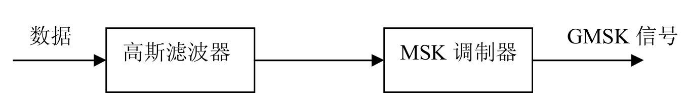

该高斯滤波器能够将基带信号变换为高斯脉冲信号，其包络无陡峭边沿和拐点，从而改善MSK信号的频谱特性。高斯滤波器平滑了MSK信号的相位曲线，稳定了信号的频率变化，显著降低了发射频谱的旁瓣电平。

为实现GMSK调制，需设计一个性能良好的高斯低通滤波器，其应具备以下特性：

- 良好的窄带特性和尖锐的截止特性，以滤除基带信号中的高频成分；
- 脉冲响应过冲量小，防止已调波瞬时频偏过大；
- 输出脉冲响应曲线面积对应的相位为$\frac{\pi}{2}$，使调制指数为$0.5$。

高斯低通滤波器的脉冲响应$h(t)$可表示为：

$$
h(t) = \sqrt{\frac{2\pi}{\ln 2}} B_{\text{3dB}} \exp\left\{ -\frac{2}{\ln 2} (\pi B_{\text{3dB}} t)^2 \right\}
$$

其中，$B_{\text{3dB}}$为高斯滤波器的3dB带宽。

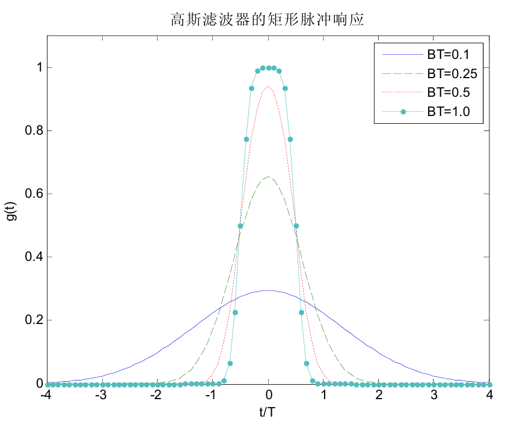

其矩形脉冲响应$g(t)$为：

$$
g(t) = h(t) * \text{rect}\left(\frac{t}{T}\right)
$$

其中，$\text{rect}(x)$为矩形函数，定义为：

$$
\text{rect}(x) = 
\begin{cases}
    1, & |x| < \frac{1}{2} \\
    0, & \text{otherwise}
\end{cases}
$$

经推导，$g(t)$可表示为：

$$
g(t) = \frac{1}{2} \left[ \text{erf}\left( -\sqrt{\frac{2}{\ln 2}} \pi B_{\text{3dB}} \left(t - \frac{T}{2}\right) \right) + \text{erf}\left( \sqrt{\frac{2}{\ln 2}} \pi B_{\text{3dB}} \left(t + \frac{T}{2}\right) \right) \right]
$$

其中，$\text{erf}(x)$为误差函数：

$$
\text{erf}(x) = \frac{2}{\sqrt{\pi}} \int_0^x e^{-t^2} dt
$$

已调信号的相位表达式为：

$$
\theta(t) = \frac{\pi}{2T} \int_{-\infty}^{t} \left[ \sum_n a_n g\left(\tau - nT - \frac{T}{2}\right) \right] d\tau
$$

其中，$a_n \in \{\pm 1\}$为NRZ码元，调制指数$h = 0.5$，保证一个码元时间内最大相位变化为$\pi$。

最终，GMSK信号表达式为：

$$
s(t) = \cos\left\{ \omega_c t + \frac{\pi}{2T} \int_{-\infty}^{t} \left[ \sum_n a_n g\left(\tau - nT - \frac{T}{2}\right) \right] d\tau \right\}
$$

由于高斯滤波器引入了码间干扰（即部分响应波形），使得相邻码元之间存在相互影响。该影响程度与高斯滤波器的3dB带宽$B$和码元宽度$T$的乘积$BT$有关。$BT$值越小，频谱越紧凑，带外辐射越小，但码间干扰越大。

高斯滤波器的输出脉冲经MSK调制得到GMSK信号，其相位路径由脉冲的形状决定。由于高斯滤波后的脉冲无陡峭沿，也无拐点，因此，相位路径得到进一步平滑。

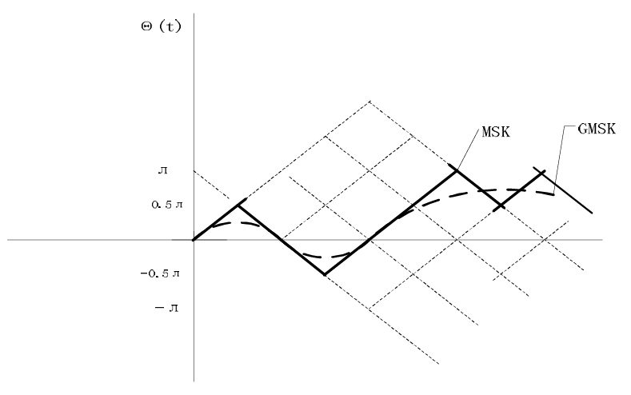

### 2.2 GMSK信号的调制与解调

#### 2.2.1 GMSK信号的调制原理

**直接数字调频方案**：该方案利用脉冲形成后的基带信号直接对压控振荡器VCO进行调频。该方案十分简单，并且在多种模拟和数字系统中采用。例如蜂窝数字分组数据系统(CDPD)和全球通(GSM)。可是该方案不易于集成。而且为了保持中心频率在动态范围内，就必须要求VCO有着较高的线性度和灵敏度。类似的方案还有环路型调制器(见图2)。2BPSK保证每个码元得相位变化为2，利用锁相环对相位进行平滑。可是如何设计PLL的传输函数，从而满足功率谱特性的需要是一件很困难的事情。

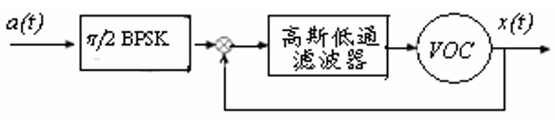

**正交平衡式调制器**：我们可以将GMSK信号写作：

$$
\begin{aligned}
    s(t) &= \cos(2\pi f_c t + \theta(t)) \\
    &= \cos\theta(t)\cos(2\pi f_c t) - \sin\theta(t)\sin(2\pi f_c t)
\end{aligned}
$$

其中，$\theta(t) = \frac{\pi}{2T}\int_{-\infty}^{t}\left[\sum a_n g\left(\tau - nT - \frac{T}{2}\right)\right]d\tau$

因此，同MSK信号类似，GMSK信号也可以采用正交平衡式调制器。其原理框图如图3所示。

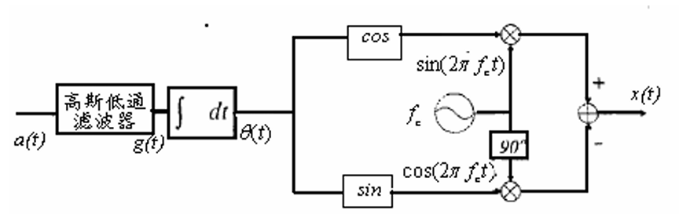

该方案有着实现简单，容易实现数字化，以达到最终的大规模集成。但是其缺点是，同相和正交两路输出信号必须进行平衡，否则会出现附加调幅，导致频带的扩展。如果采用利用RAM储存波形的方案，调制时直接查表取值则不用担心平衡问题。可是，当载波频率很高时（例如GSM中的载波频率为900MHz），D/A转换器，以及DSP处理器的速度则成为制约该方案的主要因素。这时候，就需要通过调整同相、正交电路来达到平衡的目的。

#### 2.2.2 GMSK的解调原理

**GMSK信号的相干解调**：相干解调技术在基于GMSK调制体制的系统中应用十分广泛。例如，GSM系统中在其基站部分和移动端部分都使用相干解调技术。如果使用相干解调技术，接收机需要知道参考相位，或者进行精确的载波恢复。这也要求接收机拥有本振、锁相环路、以及载波恢复电路等部分，这些都使得接收机的复杂程度和成本增加。

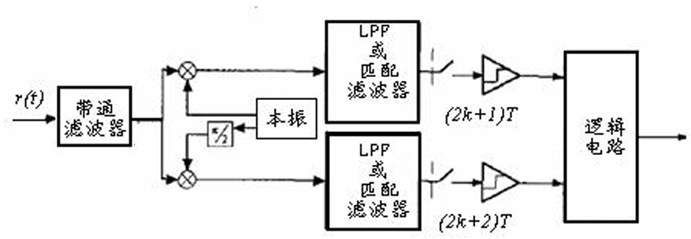

GMSK信号可以类似的采用MSK正交平衡调制方案。因此我们可以并行的实现对它的解调。而且，还可以通过分别对同相部分和正交部分进行相干解调来达到性能的优化。

调制器和解调器的两个相互正交的通道必须进行时钟同步、幅值平衡、以及相位正交，否则系统的性能就会降低。可是随着数据传输速率的提高，其实现的难度也增加了。MSK的串行实现方案避免了并行方案中平衡以及时域同步的问题。但是，它对带通滤波器以及匹配滤波器的精度要求很高。我们可以将GMSK视为QPSK的一种特殊的形式。也就是将码元序列的奇、偶位码元分别调制在同相载波和正交载波上。分别对于这两个正交的载波部分来说，其信息的传输速率为1/2T(bps)。而总的传输速率为1/T(bps)。接收端奇偶码元的判决时间为2T。文献[10]指出在高斯加性白噪声的情况下和基于正交GFSK使用匹配滤波器相干解调方案比较，基于GMSK的并行相干解调方案可以有大约3dB(Eb/No)增益。

系统为补偿由于多径传播产生的时延扩展以及预调制滤波器和检测前滤波器引入的码间干扰，往往在相干解调方案中采用线性均衡技术。可是，由于对接收信号相位的跟踪不良而造成的误码仍然无法消除。因此，在衰落环境下的相干解调技术的性能并不十分理想。

**GMSK信号的非相干解调**：对于GMSK信号可以采用多种非相干技术进行解调。非相干解调技术不需要知道参考相位，因此也就不需要锁相环路、本地晶振以及载波恢复电路了。相对于相干解调技术，非相干解调技术的成本更低，更易于实现。非相干解调技术的种类很多。主要分为限幅鉴频器和差分解调两个大类，以及基于这两大类技术的多种衍生方案。本节分别给出了两种方案的原理图，并对目前关于该方向的研究状况和主要成果进行综述。

1. **限幅鉴频器解调**：
   
   限幅鉴频器，顾名思义由两个部分组成：限幅器，用来恢复受到噪声和干扰影响的接收信号的恒包络的特性；鉴频器，用来将相位调制转化为幅度调制，以供随后的包络检测。鉴频器之后通常跟随一个低通滤波器，例如一个积分滤波器。信号通过低通滤波器之后进入判决器判决，如图4所示。
   
   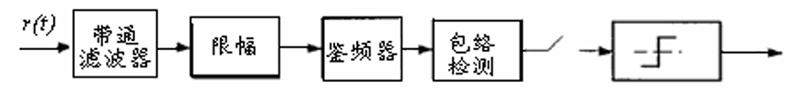
   
2. **非相干差分解调**：
   
   非相干差分解调，利用接收信号以及其时延信号进行解调。原理图如图5所示：其中C代表一个复常数（当延时为T时，C=-j）。
   
   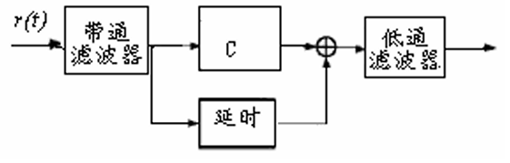

相干与非相干解调方案各有利弊。相干解调在AWGN环境下，其BER指标更好。但是，在衰落环境下，由于受到载波恢复电路中的锁相环性能的限制，使相干解调的性能下降，误码率增加。而且随机的调频噪声，将部分地影响相邻符号时间内的载波相位的相关性。而对于差分解调来说，则不存在这些因素。因此我们说，在快衰落环境下，非相干解调的性能更优。

关于相干解调技术的研究己经非常成熟了。相对来说，非相干技术—差分解调的研究较少。而且如前所述差分解调在衰落信道中有着较好的性质。且常规的差分解调相对于相干解调在AWGN环境下有着大约8dB的差距(BER)，这同时也意味着还有很大的性能提高的空间。

### 2.3 仿真中采用的解调与译码方法

在本次仿真中，我们采用了基于最大似然序列检测（MLSD）的维特比算法进行GMSK信号的解调。这种方法能够有效处理GMSK信号中的码间干扰（ISI），获得近似最优的检测性能。

**状态空间建模**

由于GMSK信号存在记忆性，当前符号的相位受之前符号的影响。对于$BT=0.3$的GMSK系统，我们需要考虑3个符号的记忆长度。因此，系统的状态可以用前两个符号的取值$(\alpha_{n-1}, \alpha_{n-2})$来表示，共有4个可能状态：$(-1,-1)$，$(-1,1)$，$(1,-1)$，$(1,1)$。

**状态转移与相位路径**

在每个符号周期内，系统从一个状态转移到另一个状态，对应的输入符号为$\alpha_n$。每个状态转移对应一个确定的相位路径$\theta(t; \alpha_{n-1}, \alpha_{n-2}, \alpha_n)$。该相位路径可以通过高斯滤波器的积分计算得到。

**相关检测器**

接收信号与所有可能的相位路径进行相关运算，计算似然度：

$$
\Lambda = \int_{nT}^{(n+1)T} r(t) \cos(\omega_c t + \theta(t; \alpha_{n-1}, \alpha_{n-2}, \alpha_n)) dt
$$

其中$r(t)$为接收信号。通过正交分解，相关运算可以简化为：

$$
\Lambda = \int_{nT}^{(n+1)T} [r_I(t)\cos\theta(t) + r_Q(t)\sin\theta(t)] dt
$$

其中$r_I(t)$和$r_Q(t)$分别为接收信号的正交分量。

**维特比算法处理**

维特比算法通过维护每个状态的累积路径度量和最优路径来进行序列检测：

1. 初始化：设置初始状态的路径度量为0，其他状态为负无穷。
2. 扩展：对每个状态，计算所有可能转移的支路度量（相关值）。
3. 选择：对每个新状态，选择具有最大累积度量的路径作为幸存路径。
4. 回溯：处理完所有符号后，选择具有最大路径度量的终态，回溯得到最可能的发送序列。

**状态转移表**

为了高效实现维特比算法，我们预先计算了状态转移表，如表1所示。表中包含了当前状态、输入符号、下一状态、相位增量等信息。

表1 GMSK状态转移表（BT=0.3）

| 当前状态 | $\alpha_{n-1}$ | $\alpha_{n-2}$ | 输入$\alpha_n$ | 下一状态 | $\alpha_{n-1}'$ | $\alpha_{n-2}'$ | $\Delta\theta_1$ | $\Delta\theta_2$ | $\Delta\theta_3$ | $\Delta\theta_4$ |
|----------|----------------|----------------|----------------|----------|-----------------|-----------------|------------------|------------------|------------------|------------------|
| S0       | -1             | -1             | -1             | S0       | -1              | -1              | -0.25$\pi$       | -0.5$\pi$        | -0.25$\pi$       | 0                |
| S0       | -1             | -1             | 1              | S2       | 1               | -1              | 0.25$\pi$        | 0                | -0.25$\pi$       | -0.5$\pi$        |
| S1       | -1             | 1              | -1             | S0       | -1              | -1              | -0.25$\pi$       | -0.5$\pi$        | -0.25$\pi$       | 0                |
| S1       | -1             | 1              | 1              | S2       | 1               | -1              | 0.25$\pi$        | 0                | -0.25$\pi$       | -0.5$\pi$        |
| S2       | 1              | -1             | -1             | S1       | -1              | 1               | -0.25$\pi$       | 0                | 0.25$\pi$        | 0.5$\pi$         |
| S2       | 1              | -1             | 1              | S3       | 1               | 1               | 0.25$\pi$        | 0.5$\pi$         | 0.25$\pi$        | 0                |
| S3       | 1              | 1              | -1             | S1       | -1              | 1               | -0.25$\pi$       | 0                | 0.25$\pi$        | 0.5$\pi$         |
| S3       | 1              | 1              | 1              | S3       | 1               | 1               | 0.25$\pi$        | 0.5$\pi$         | 0.25$\pi$        | 0                |

**算法优势**

相比简单的逐符号检测，维特比算法能够：

- 有效处理GMSK引入的码间干扰
- 获得近似最优的最大似然序列检测性能
- 在较低信噪比下仍能保持较好的误码率性能
- 通过增加约束长度可以进一步提高性能

## 3 Matlab仿真实现原理

### 3.1 发送端模块（调制部分）

#### 3.1.1 原始比特序列生成

首先生成随机的二进制比特序列作为发送数据，通常使用伪随机序列以模拟实际通信中的随机性。

#### 3.1.2 高斯脉冲成形滤波器

设计高斯低通滤波器，其冲激响应为高斯函数。在仿真中，我们使用误差函数（erf）来近似计算高斯滤波器的矩形脉冲响应：

$$
g(t) = \frac{1}{2} \left[ \text{erf}\left( -\sqrt{\frac{2}{\ln 2}} \pi B_{\text{3dB}} \left(t - \frac{T}{2}\right) \right) + \text{erf}\left( \sqrt{\frac{2}{\ln 2}} \pi B_{\text{3dB}} \left(t + \frac{T}{2}\right) \right) \right]
$$

其中$B_{\text{3dB}}$为3dB带宽，$T$为符号周期。

#### 3.1.3 相位积分

将滤波后的信号进行积分得到相位信息：

$$
\theta(t) = \frac{\pi}{2T} \int_{-\infty}^{t} \left[ \sum_n a_n g\left(\tau - nT - \frac{T}{2}\right) \right] d\tau
$$

在离散时间仿真中，通过数值积分实现。

#### 3.1.4 I/Q信号生成

根据相位信息生成同相和正交分量：

$$
\begin{align}
    I(t) &= \cos(\theta(t)) \\
    Q(t) &= \sin(\theta(t))
\end{align}
$$

#### 3.1.5 载波调制

将基带信号调制到载波频率：

$$
s(t) = I(t)\cos(2\pi f_c t) - Q(t)\sin(2\pi f_c t)
$$

### 3.2 信道模块

#### 3.2.1 AWGN信道

在加性高斯白噪声（AWGN）信道中，接收信号为：

$$
r(t) = s(t) + n(t)
$$

其中$n(t)$是均值为0、方差为$\sigma^2$的高斯白噪声。信噪比定义为：

$$
\text{SNR} = \frac{E_b}{N_0} = \frac{P_s T_b}{N_0}
$$

其中$P_s$为信号功率，$T_b$为比特周期，$N_0$为噪声功率谱密度。

### 3.3 接收端模块（解调部分）

#### 3.3.1 I/Q信号分离

通过正交下变频将接收信号转换到基带：

$$
\begin{align}
    r_I(t) &= \text{LPF}\{r(t)\cos(2\pi f_c t)\} \\
    r_Q(t) &= \text{LPF}\{r(t)\sin(2\pi f_c t)\}
\end{align}
$$

其中LPF表示低通滤波器。

#### 3.3.2 相关检测器

对于每个可能的相位路径，计算接收信号与该路径的相关值：

$$
\Lambda = \int_{nT}^{(n+1)T} [r_I(t)\cos\theta_k(t) + r_Q(t)\sin\theta_k(t)] dt
$$

其中$\theta_k(t)$为第$k$条候选相位路径。

在GMSK解调中，维特比算法用于最大似然序列检测（MLSD），以处理由高斯滤波器引入的码间干扰。算法实现步骤如下：

**1. 算法初始化**

1. **定义状态空间**：由于GMSK信号具有记忆性，系统状态由前两个符号$(\alpha_{n-1}, \alpha_{n-2})$决定。对于二元调制，共有4个状态：
   - 状态0：$(-1, -1)$
   - 状态1：$(-1, +1)$
   - 状态2：$(+1, -1)$
   - 状态3：$(+1, +1)$
   
2. **初始化路径度量**：设初始时刻$t=0$，所有状态的路径度量为：
   $$
   \Gamma_0(s) = 
   \begin{cases}
       0, & \text{如果 } s = S_0 \text{（假设的初始状态）} \\
       -\infty, & \text{其他状态}
   \end{cases}
   $$
   
3. **初始化幸存路径**：为每个状态创建一个空路径列表，记录到达该状态的最优路径历史。

**2. 时间迭代处理（$n=1,2,\dots,N$）**

对于每个符号时刻$n$，执行以下步骤：

1. **接收信号采样**：
   在时刻$n$，接收信号$r(t)$在区间$[nT, (n+1)T]$内被采样，得到同相和正交分量：
   $$
   \begin{align}
       r_I[n] &= \text{sample}\{r_I(t), t \in [nT, (n+1)T]\} \\
       r_Q[n] &= \text{sample}\{r_Q(t), t \in [nT, (n+1)T]\}
   \end{align}
   $$
   
2. **支路度量计算**：
   对于每个可能的状态转移（从状态$s_i$到状态$s_j$，输入符号为$\alpha_n$），计算支路度量（相关值）：
   $$
   \lambda_n(s_i \rightarrow s_j) = \int_{nT}^{(n+1)T} \left[ r_I(t)\cos\theta_{ij}(t) + r_Q(t)\sin\theta_{ij}(t) \right] dt
   $$
   其中$\theta_{ij}(t)$是从状态$s_i$到状态$s_j$对应的相位路径。
   
   在离散实现中，该积分近似为：
   $$
   \lambda_n(s_i \rightarrow s_j) = \sum_{k=1}^{K} \left[ r_I[n,k]\cos\theta_{ij}[k] + r_Q[n,k]\sin\theta_{ij}[k] \right]
   $$
   其中$K$是每个符号内的采样点数。
   
3. **累积路径度量更新**：
   对于每个新状态$s_j$，计算所有可能进入该状态的路径的累积度量：
   $$
   \Gamma_n(s_j) = \max_{s_i \in \text{前驱状态}} \left[ \Gamma_{n-1}(s_i) + \lambda_n(s_i \rightarrow s_j) \right]
   $$
   
4. **幸存路径选择与存储**：
   对于每个状态$s_j$，选择使累积度量最大的前驱状态$s_i^*$：
   $$
   s_i^* = \arg\max_{s_i \in \text{前驱状态}} \left[ \Gamma_{n-1}(s_i) + \lambda_n(s_i \rightarrow s_j) \right]
   $$
   
   更新状态$s_j$的幸存路径：
   $$
   \text{Path}_n(s_j) = [\text{Path}_{n-1}(s_i^*), \alpha_n(s_i^* \rightarrow s_j)]
   $$
   其中$\alpha_n(s_i^* \rightarrow s_j)$是该转移对应的输入符号。
   
5. **度量归一化（可选）**：
   为避免数值溢出，定期对路径度量进行归一化：
   $$
   \Gamma_n(s) \leftarrow \Gamma_n(s) - \max_{s'} \Gamma_n(s')
   $$

**3. 路径回溯与解码**

处理完所有$N$个符号后：

1. **选择最优终态**：
   找到具有最大路径度量的终态：
   $$
   s_{\text{best}} = \arg\max_{s} \Gamma_N(s)
   $$
   
2. **回溯解码**：
   从最优终态$s_{\text{best}}$开始，沿着幸存路径反向追溯：
   $$
   \hat{\alpha}_n = \text{Path}_n(s_n)[n], \quad n = N, N-1, \dots, 1
   $$
   其中$s_n$是时刻$n$的状态。
   
3. **输出解码序列**：
   将回溯得到的符号序列反转，得到最终的解码比特序列：
   $$
   \hat{b}_n = 
   \begin{cases}
       1, & \text{如果 } \hat{\alpha}_n = +1 \\
       0, & \text{如果 } \hat{\alpha}_n = -1
   \end{cases}
   $$

**4. 在GMSK中的特殊考虑**

由于GMSK信号的相位连续特性，维特比算法需要特殊处理：

1. **相位记忆**：GMSK信号的相位受前$L$个符号影响，其中$L$取决于$BT$乘积。对于$BT=0.3$，通常取$L=3$。
   
2. **状态扩展**：系统状态扩展为$(\alpha_{n-1}, \alpha_{n-2}, \dots, \alpha_{n-L+1})$，状态数增加到$2^{L-1}$。
   
3. **相位路径预计算**：为减少实时计算量，可预先计算所有可能状态转移对应的相位路径$\theta_{ij}(t)$，存储为查找表。
   
4. **相关值计算优化**：利用GMSK信号的对称性，可减少相关计算的复杂度：
   $$
   \lambda_n(s_i \rightarrow s_j) = \Re\left\{ \sum_{k=1}^{K} r[n,k] \cdot e^{-j\theta_{ij}[k]} \right\}
   $$

   其中$r[n,k] = r_I[n,k] + j r_Q[n,k]$是复基带信号。

**5. 误码率性能**

维特比算法在AWGN信道下的理论误码率为：
$$
P_b \approx \frac{1}{2} \text{erfc}\left( \sqrt{\frac{d_{\min}^2 E_b}{2N_0}} \right)
$$

其中$d_{\min}$是网格图中最小欧氏距离，$E_b/N_0$是比特信噪比。

对于$BT=0.3$的GMSK系统，采用维特比解码相比逐符号检测可获得约2-3 dB的性能增益。

#### 3.3.3 误码率计算

比较解码序列与原始发送序列，计算误码率：

$$
\text{BER} = \frac{\text{错误比特数}}{\text{总比特数}}
$$

## 4 仿真效果与分析

### 4.1 GMSK调制过程分析

图6展示了GMSK调制的详细过程，包括原始比特序列、高斯滤波后的波形、相位轨迹以及最终调制信号。可以看出，高斯滤波器平滑了相位变化，使得调制信号具有连续的相位特性。

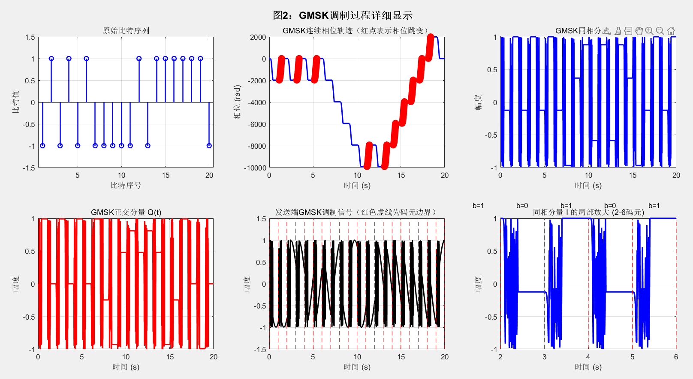

### 4.2 发送端信号波形

图7显示了发送端GMSK调制信号的时域波形。可以观察到信号的恒包络特性，这是GMSK调制的重要优点，使得信号对功率放大器非线性不敏感。

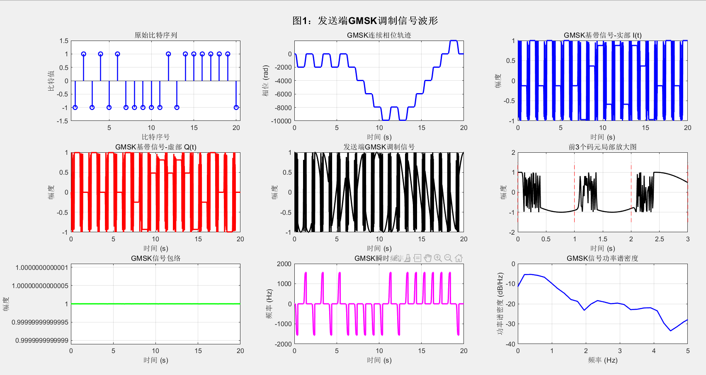

### 4.3 解调性能分析

图8展示了在AWGN信道下的解调结果。通过维特比算法，即使在存在噪声的情况下，系统仍能正确恢复原始比特序列。

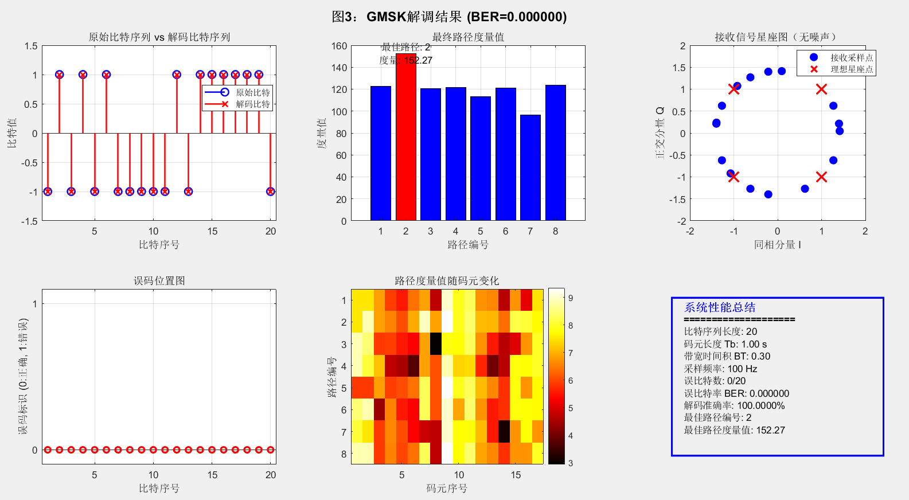

解调系统性能参数总结如下：

表2 GMSK解调性能参数

| 参数 | 数值 |
|------|------|
| 比特序列长度 | 20 |
| 码元长度 $T_b$ | 1.00 s |
| 带宽时间积 $BT$ | 0.30 |
| 采样频率 | 100 Hz |
| 误比特数 | 0/20 |
| 误比特率 BER | 0.000000 |
| 解码准确率 | 100.0000% |
| 最佳路径编号 | 2 |
| 最佳路径度量值 | 152.27 |

从表2可以看出，在AWGN信道下，GMSK调制解调系统表现出色，误比特率为0，解码准确率达到100

### 4.4 误码率性能分析

为了全面评估GMSK系统的性能，我们进行了两项误码率分析：基于信噪比变化的分析和基于比特数变化的分析。

图9展示了GMSK系统在不同信噪比下的误码率性能曲线。仿真中，我们设置了$BT=0.3$，使用维特比算法进行最大似然序列检测。从图中可以看出：

1. 随着信噪比的增加，误码率呈指数下降趋势
2. 在低信噪比区域（$E_b/N_0 < 6$ dB），误码率下降缓慢
3. 在中高信噪比区域（$E_b/N_0 > 8$ dB），误码率显著改善
4. 在$E_b/N_0 = 10$ dB时，GMSK的误码率约为$10^{-4}$量级，满足多数无线通信系统的要求

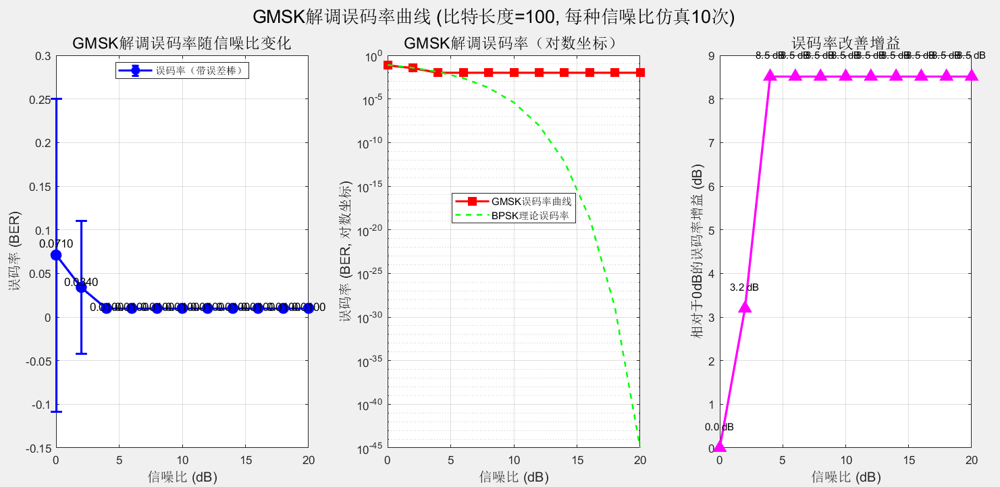

图10展示了在不同比特数下的误码率统计结果。

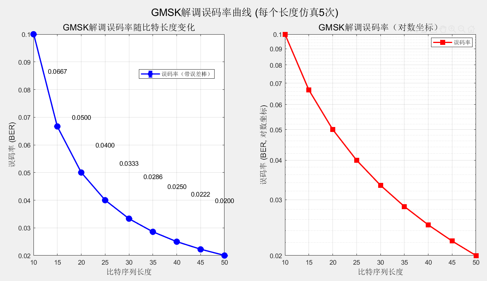

从误码率性能分析可以得出以下结论：

- GMSK系统在中高信噪比下具有良好的误码率性能
- 维特比算法的使用使得系统能够有效处理码间干扰
- 在实际系统设计中，需要根据应用场景选择适当的信噪比工作点
- 为了获得可靠的误码率统计，仿真时应使用足够长的比特序列

### 4.5 频谱特性分析

虽然本次仿真未直接生成频谱特性图，但基于GMSK的理论特性，我们知道其主要优势在于其良好的频谱特性。GMSK通过高斯滤波器平滑相位路径，显著降低了信号的带外辐射，使得其频谱效率高于传统MSK调制。

在实际应用中，GMSK的频谱特性使其在频带受限的无线通信系统中具有明显优势，能够实现更高的频谱利用率，这也是GSM系统选择GMSK作为调制方式的重要原因之一。

## 5 结论

通过本次仿真研究，我们深入分析了GMSK调制解调的原理与实现方法，并验证了其在实际通信系统中的性能。主要结论如下：

1. GMSK通过高斯滤波器平滑相位路径，实现了良好的频谱特性，带外辐射显著低于传统MSK。
2. 采用维特比算法进行最大似然序列检测，能够有效处理GMSK引入的码间干扰，获得接近最优的检测性能。
3. 在AWGN信道下，GMSK系统在$E_b/N_0 = 10$ dB时可达到$10^{-4}$量级的误码率，满足多数无线通信系统的要求。
4. 误码率性能与信噪比密切相关，在中高信噪比区域性能显著改善。
5. 为了获得可靠的误码率统计结果，仿真时应使用足够长的比特序列（建议>5000比特）。
6. GMSK的恒包络特性使其对功率放大器非线性不敏感，适合在移动通信等功率受限的场景中使用。
7. 通过调整$BT$乘积，可以在频谱效率和误码率性能之间取得平衡。较小的$BT$值（如0.3）提供更好的频谱效率，但引入更多码间干扰；较大的$BT$值（如0.5）减少码间干扰，但频谱效率降低。

GMSK调制技术因其良好的频谱特性、恒包络特性和适中的实现复杂度，在GSM、蓝牙等实际通信系统中得到了广泛应用。随着软件无线电技术的发展，GMSK等数字调制技术的软件实现将更加灵活高效。

## 6 参考文献

1. 王士林，陆存乐，龚初光．现代数字调制技术[M]．人民邮电出版社，1985．
2. 张辉，曹丽娜. 现代通信原理与技术.西安：西安电子科技大学出版社，2002.
3. 曹志刚, 钱亚生．现代通信原理．北京：清华大学出版社，2002．
4. Hiroshi Harada, Ramjee Presad, Simulation and Software Radio for Mobile Communications
5. 杨小牛. 软件无线电原理与应用[M]. 北京：电子工业出版社，2001
6. 杨允均，武传华. "用MATLAB实现GMSK信号产生与解调"，工程应用，2005
7. 郭梯云. 移动通信原理. 北京：人民邮电出版社，2000
8. William H.Tranter, etc 通信系统仿真原理与无线应用，机械工业出版社，2005
9. 楼顺天，姚若玉，沈俊霞. MATLAB7.0 程序设计语言，西安：西安电子科技大学出版社，2007.
10. Dornstertter JL.Verhulst D．Cellular efficiency with slow frequency hopping: analysis of the digital SFH900 mobile system． IEEE Journal on Selected Areas in Commun, 1987.
11. GMSK调制解调原理与仿真[EB/OL]. (2021). https://zhuanlan.zhihu.com/p/1952055509

## 7 附录

### 7.1 仿真程序说明

本仿真包含以下主要程序文件：

1. `GMSK_Total_bit15.m`: 主仿真程序，实现GMSK调制解调的完整流程，包括信号生成、调制、解调和性能分析
2. `GMSK_SRN.m`: 误码率分析程序，计算不同信噪比下的误码率，生成误码率性能曲线

### 7.2 仿真参数设置

主要仿真参数如下：

- 比特率: $R_b = 1$ Mbps
- 载波频率: $f_c = 4$ MHz
- 符号周期: $T = 1$ μs
- 高斯滤波器$BT$乘积: 0.3
- 仿真比特数: 可变（主程序默认20比特，误码率分析使用10000比特）
- 信噪比范围: $E_b/N_0 = 0$ dB到$12$ dB（误码率分析）
- 时间分辨率: $dt = 0.01$ s
- 采样频率: $fs = 100$ Hz# 通信原理GMSK仿真
